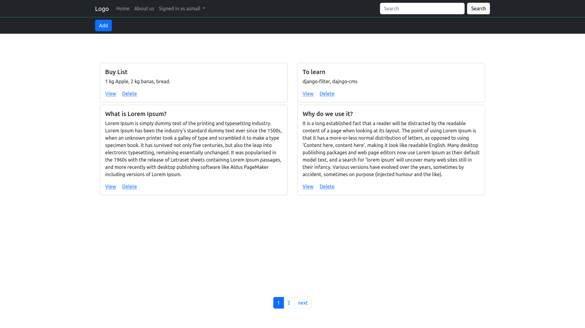

# DjangoNoteEditor

A Simple note editor in Django.

### Installing instruction

pip install -r requirements.txt

Create .env file in same folder as settings.py with following Cloudinary configuration:\
"""\
cloud_name='cloud_name'\
api_key='api_key'\
api_secret='api_secret'\
api_proxy=http://proxy.server:3128 # only needed if deployed at PythonAnywhere\
"""

###
api_proxy is only need if deployed at PythonAnywhere where communication to outside severs need to be done via their proxyserver. PythonAnywhere's proxyservers whitelist can be viewed from [here](https://www.pythonanywhere.com/whitelist/).

If you don't want use Cloudinary service change NoteImage to use django.db.models.imagefield instead of cloudinary.models.CloudinaryField. Bewere: during deployment Django dosen't serve image files itself. Read more about it [here](https://docs.djangoproject.com/en/4.1/howto/deployment/wsgi/modwsgi/). 

CLOUDINARY is a service which enables to upload and download images. CLOUDINARY django sample project: https://github.com/cloudinary/cloudinary-django-sample. 

### Test online
You can test the app online via this [link](http://asmail.eu.pythonanywhere.com/editor) until Thursday 30 March 2023. Create a account or log in with
"RandomPerson" as username and "simple-Password1" as password.

### run

python manage.py runserver

# preview

## home page

#

## note view page

#

## note search page

#

## home page for smartphone

  
   
<a href ="https://www.moviezine.se/nyheter/batman-the-animated-series-fyller-25-ar"> batman img source </a>

